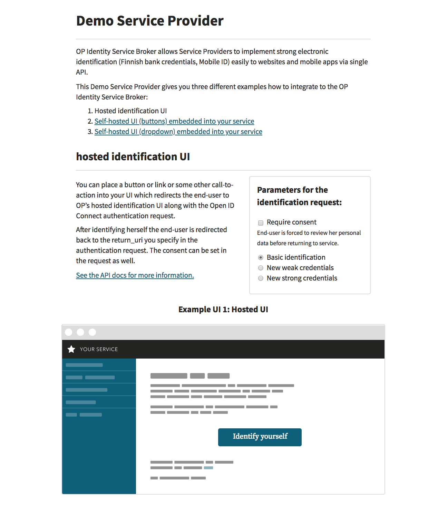
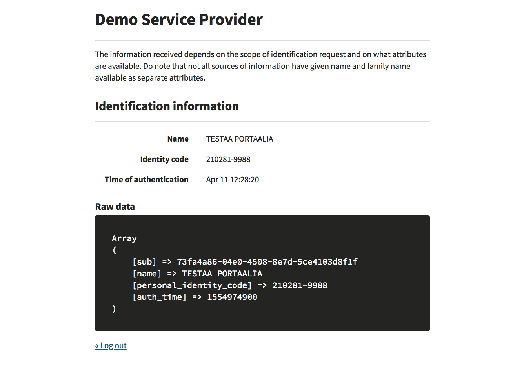

# Service Provider integration example for the OP Identity Service Broker

Warning: This integration example is deprecated and will not be updated anymore. Current version is depending on a very old JOSE (gree/jose) library which is abandoned. JOSE itself depends on phpseclib 2.x and does not work with phpseclib 3.x. Code in general is written in oldish style and the structure is not ideal. Therefore the example is deprecated.

This repository provides an easy way to test OP identification
services. It also serves as a PHP-based implementation example to help Servide Providers (SP) to integrate to the OP Identitity Service Broker (ISB).

This example is the OP Demo Service Provider, which runs in a Docker container and it connects with the OP ISB sandbox environment.

This Demo Service Provider gives you three different examples how to integrate to the OP's Identity Service Broker:
- OP's hosted Identification UI
- Embedded identification UI with buttons
- Embedded identification UI with dropdown

## OP's hosted Identification UI

In this example the Identification UI is hosted by the OP's Identity Service Broker. Authorization is started by clicking the "Identify Yourself" - button shown on the UI.

## Embedded identification UI with buttons

In this example the Identification UI is embedded into the Demo Service Provider. Authorization request is sent by clicking one of the Identity Provider buttons shown on the UI.

## Embedded identification UI with dropdown

In this example the Identification UI is embedded into the Demo Service Provider. Authorization request is sent by by choosing an Identity Provider from the dropdown menu shown on the UI.

## Additional parameters for testing purposes

In all three examples it is possible to select the identification purpose (See the scope-parameter in the flow chapter of the API-document):
- normal
- weak (for weak identifiers, for example user account with user-id and password)
- strong (for official strong authentication)

In your implementation there won't be such selection for the end users. The purpose selection is there to illustrate how it looks like at the code level and in the interface between the SP and the ISB when the SP is using such purpose. SP needs to use one of these three methods when initiating the identification process with the ISB.

In all three examples it is also possible to select whether consent is required or not (See the consent-parameter in the flow chapter of the API-document). In your implementation there won't be such selection for the end users. The consent parameter is there to illustrate how it looks like in the code level, in the ISB UI and in the interface between the SP and the ISB when the SP is requesting consent to be requested from the end users during the identification process. It is up to the SP to decide during the implementation phase whether to request this consent or not.


Screenshot for the Service Provider example:



Identification done:




## Requirements
- Docker and Docker Compose need to be installed on the host computer. See https://www.docker.com/get-docker
- Port 80 needs to be free on the host computer

## Documentation

The OP Identity Service Broker (ISB) API-documentation is available here. See https://github.com/op-developer/Identity-Service-Broker-API .

## Security limitations

Please note that this integration example demo application has the following identified security issues:
- The following security headers are missing (in production these should be set properly):
    - The anti-clickjacking X-Frame-Options header.
    - The X-XSS-Protection header is not defined. This header can hint to the user agent to protect against some forms of XSS
    - The X-Content-Type-Options header is not set. This could allow the user agent to render the content of the site in a different fashion to the MIME type
    - HTTP Strict-Transport-Security header is not set. This demo application uses http, not https. https has to be used in production and then this header is mandatory
- The demo application is run as root in the Docker container. In production, the application should be run as non-root
- Cookie is not protected. In production the httpOnly flag must be added to the PHPSESSID cookie
- The error page is vulnerable to reflected Cross-site scripting. In production there should be input validation and output encoding.
- demo application information leakage. It is possible to get some details about the system by using malformed input parameters, or in certain case, by calling the same method again with the same information. Also errors expose details on purpose to help the integration work. In production there should be user input validations and errors should not expose details of the system.
- nonce in ID Token is not checked against the one that was given in oauth/authorize

## Usage

On the host computer give the following commands:

```bash
git clone <repo-url> my-isb-test
cd my-isb-test
docker-compose up --build
```

When the container is up and running, please open the browser and go to the http://localhost . You can move between the three different UI examples following links in the UI.